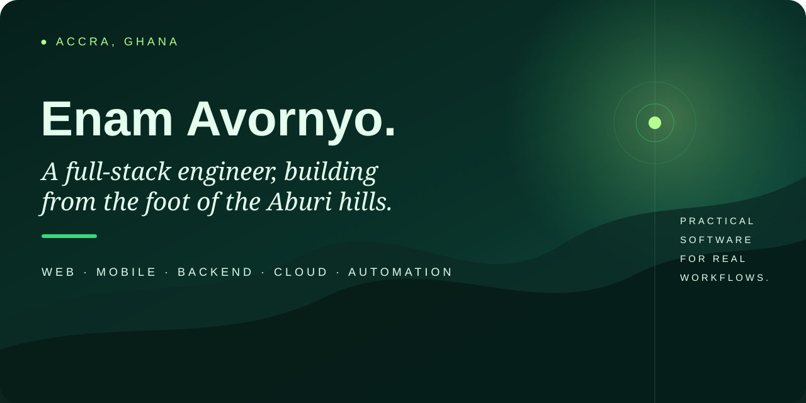

  

I’m a **full-stack software engineer** who designs and builds web, mobile, backend, and cloud-ready software for real workflows.

My work spans product interfaces, APIs, React Native applications, database-backed systems, integrations, automation, testing, and delivery. I care about clear architecture, maintainable code, useful documentation, and software that solves practical problems.

### Build · Solve · Ship · Repeat

- **Web:** React, Next.js, TypeScript, JavaScript
- **Mobile:** React Native, Expo
- **Backend:** Node.js, NestJS, Python, FastAPI, Java, Spring Boot, PHP, Laravel
- **Data & delivery:** PostgreSQL, MySQL, Redis, Docker, GitHub Actions, cloud services

## Selected work

Some of my independent engineering work lives under **[EAV Labs](https://github.com/eav-labs-dev)** — a personal engineering lab where I build and document production-style software systems.

| Project | What it explores | Stack |
| --- | --- | --- |
| [**EAV Insight**](https://github.com/eav-labs-dev/eav-insight-api) | Document intake, operational reporting, searchable business records | FastAPI · PostgreSQL · Docker |
| [**EAV Field**](https://github.com/eav-labs-dev/eav-field-mobile) | Offline-first field inspections, evidence capture, synchronization | React Native · Expo · TypeScript |
| [**EAV Dispatch**](https://github.com/eav-labs-dev/eav-dispatch-service) | Logistics, assignments, shipment lifecycles, audit history | Java · Spring Boot · PostgreSQL |
| [**EAV Ledger**](https://github.com/eav-labs-dev/eav-ledger-api) | Billing, invoices, payments, and business workflows | PHP · Laravel · PostgreSQL |

## Elsewhere

[LinkedIn](https://www.linkedin.com/in/enamk/) · [Portfolio](https://portfolio.enamavornyo.workers.dev/) · [EAV Labs](https://github.com/eav-labs-dev) · **enamavornyo@gmail.com**
